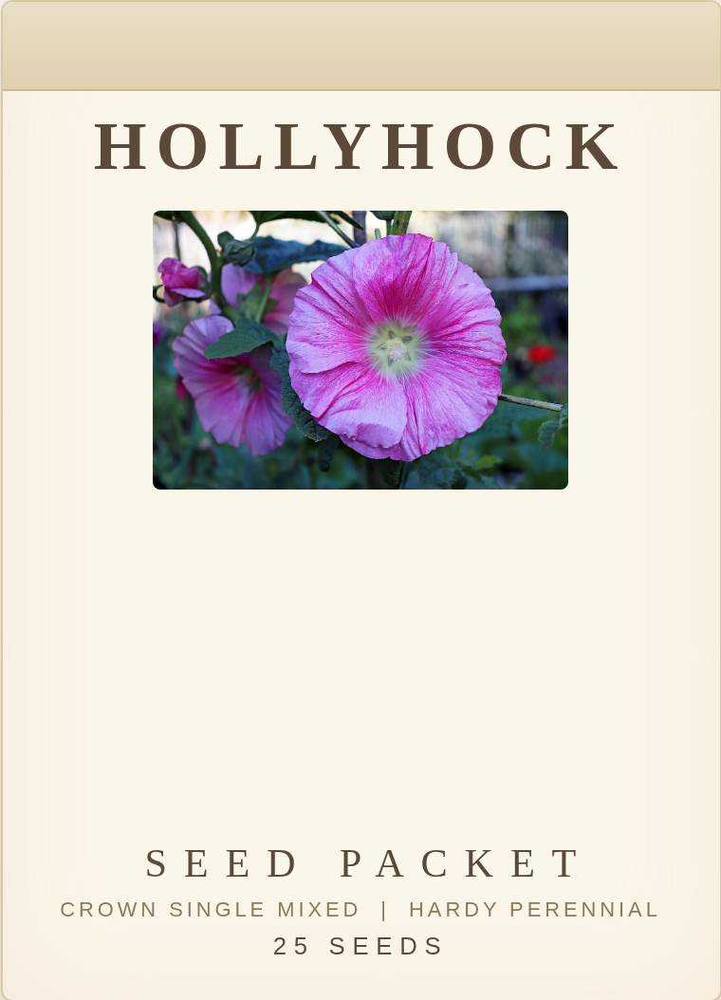
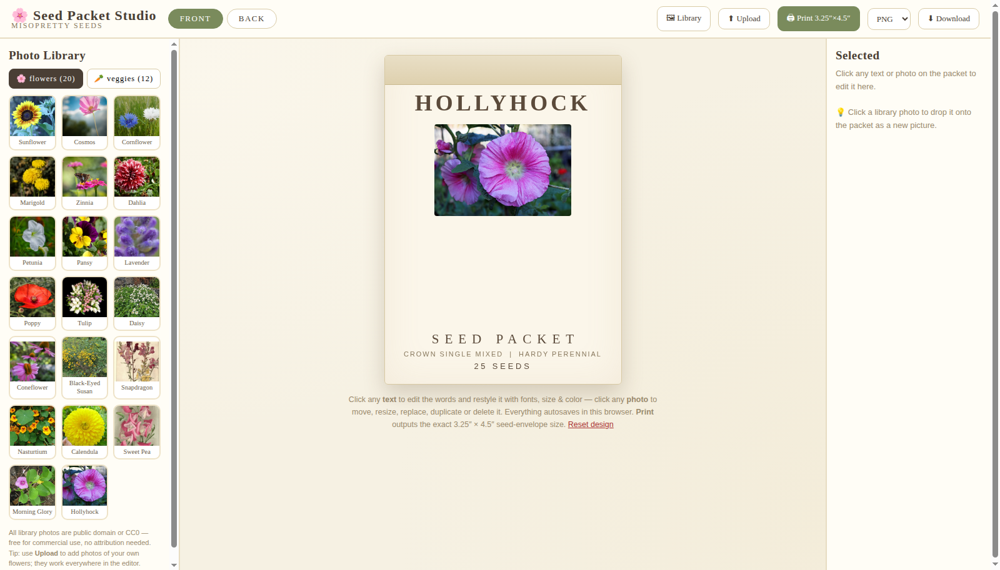

# 🌱 Seed Packet Studio

A cute, canvas-style **seed packet designer** that runs entirely in your browser — no installs, no accounts, no build step. Design the front and back of a seed packet, then print it at the exact standard seed-envelope size.

**Live demo:** https://misoprettystacks.github.io/Seed-Packet-Studio/

## What a finished packet looks like

## What the studio looks like

## Features

- **Front & back packet tabs** — design both sides of the envelope
- **Photo library built in** — 20 flowers + 12 vegetables, drag them on as stickers
- **Sticker editing** — drag, resize, replace, duplicate, delete, reorder layers
- **Upload your own photos** — use them anywhere in the editor
- **27 fonts** (lazy-loaded from Google Fonts) with size, color, bold, italic & alignment controls
- **Add your own text** anywhere on the packet
- **Autosave** — your work is saved in the browser automatically
- **Print button** — outputs the exact **3.25″ × 4.5″** standard seed-envelope size
- **Downloads** — export as PNG, JPG, PDF or SVG
- **Reset** — one click restores the original template

## Photo library license

Every photo in `library/` was individually verified as **public domain or CC0** — free for commercial use, **no attribution required**. Each photo's source page and license is recorded in [`library/manifest.json`](library/manifest.json).

## Run it yourself

No build needed — it's a single HTML file:

1. Download or clone this repo (keep the `library/` folder next to the HTML file).
2. Open `Seed_Packet_Studio.html` in any modern browser.
3. Design, print, done.

Or just use the live demo link above.

## Print size

The print stylesheet targets the standard seed packet envelope: **3.25 in × 4.5 in** (`@page { size: 3.25in 4.5in; margin: 0; }`).

---

Made with 💖 by [@MisoPrettyStacks](https://github.com/MisoPrettyStacks)
